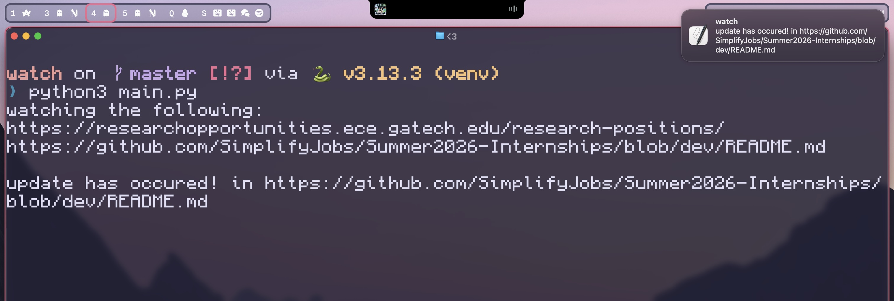

# Watch: A local python utility to watch websites and notify upon change

## Examples:
Here is what the process should look like:



In this use case, the program is monitoring a [tech internship repository](https://github.com/SimplifyJobs/Summer2026-Internships) and pushing a notification each time a new listing is posted

You could also use this to monitor things like price changes, lab postings, etc. (though some use cases will probably require some tinkering in order to work, especially with more dynamically rendered sites)

## Usage:
Ensure selenium is installed (i used 4.35.0 but older versions should work)

```zsh
python -m venv venv 
source venv/bin/activate
pip install selenium
```


 Enter the websites you wish to watch (line separated) in `sites.txt` and run the program with (ensure you've activated the venv)

```zsh
python main.py
```

## Disclaimers:
- This is still very wip and also for personal use, so there will be issues

- Right now notifications are only sent in macos with `osascript`, so the only feedback in other operating systems is in the terminal 

- This monitors for changes in the text content of a website, however sometimes text updates without indicating a change and false notifications sometimes occur
  - To slightly alleviate this, the program ignores numbers by default (as things relating to time update constantly), but will definitely change in the future
